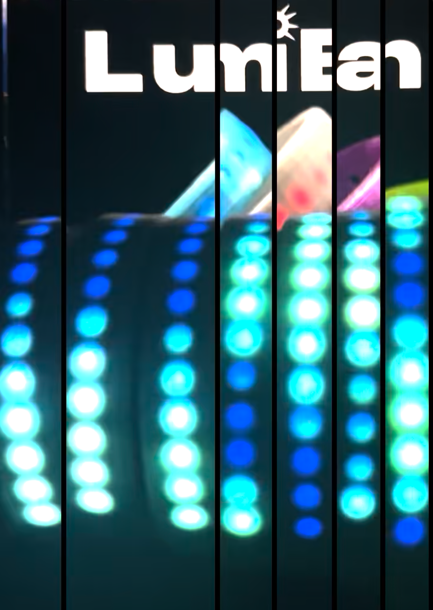
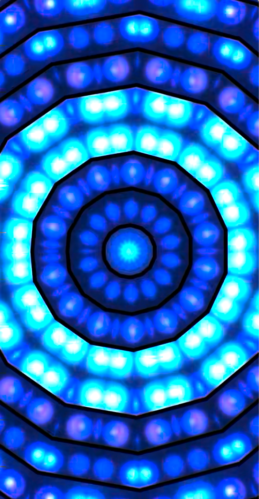

# kaleido

Standalone Python CLI tools for creative video processing, focused on footage of LED strips wrapped around a moving arm.  All tools preserve HDR (10-bit HEVC) via ffmpeg pipes and use GPU acceleration on Apple Silicon (MPS) and CUDA cards where relevant.

- `kaleidoscope.py` — mirrored radial kaleidoscope effect
- `led_pack.py` — detect N strips and pack them side by side (SAM2 or blob tracking)
- `led_pack_ski.py` — scikit-image alternative to SAM2 for `led_pack`
- `led_track.py` — visual diagnostic: overlay tracker output on the source clip
- `led_squeeze.py` — straighten each detected strip and vertically squeeze out dark gaps
- `led_squeeze_v2.py` — like `led_squeeze` but keeps each strip's natural curved shape

---

## What it does

| Step 1 — Original footage | Step 2 — Strips extracted | Step 3 — Kaleidoscope |
|:---:|:---:|:---:|
|  |  |  |
| Raw video of an arm wearing 7 LumiBand LED strips, filmed on a tripod. The strips are spread across the frame with background visible between them. | `led_pack.py` estimates the background via temporal median, uses SAM2 to lasso each strip with a pixel-precise mask, and packs the 7 cutouts side-by-side with a black gap. | `kaleidoscope.py` folds the packed strip video into a mirrored radial pattern — here with 12 segments, producing the symmetric LED mandala effect. |

---

## kaleidoscope.py

Applies a mirrored radial kaleidoscope effect to video clips.  For each output pixel it computes the angle and radius from a center point, folds the angle into `360°/segments` mirror-symmetric wedges, and samples the source frame at the reflected position.  All parameters can be animated over the clip.

### Install

```bash
pip install opencv-python numpy   # required
pip install torch                 # optional — enables GPU path (requires Python ≤ 3.12)
# ffmpeg + ffprobe must be on PATH
```

### Quick start

```bash
# Static kaleidoscope, 8 segments
python3.12 kaleidoscope.py input.mov -o output.mp4 --segments 8

# Animated swirl (15 °/sec rotation)
python3.12 kaleidoscope.py input.mov -o output.mp4 --segments 8 --spin 15

# Ramp from 16 segments down to 1 (dissolves back to original image)
python3.12 kaleidoscope.py input.mov -o output.mp4 --segments 16 --seg-end 1

# Slow-wandering center + zoom
python3.12 kaleidoscope.py input.mov -o output.mp4 --segments 10 --pan-speed 0.1 --zoom 1.4

# Batch — multiple inputs → output directory
python3.12 kaleidoscope.py clip1.mp4 clip2.mov -o out_dir/ --segments 12 --spin 15
```

### All options

| Flag | Default | Description |
|---|---|---|
| `--segments N` | 8 | Number of mirrored wedges. Floats accepted. Good range: 6–16. |
| `--seg-end N` | — | Ramp segment count to N over the clip. `0` dissolves the last mirror plane back to the original image. |
| `--seg-end-time S` | end | Time in seconds when the ramp finishes. |
| `--seg-end-frame F` | end | Frame number when the ramp finishes. Mutually exclusive with `--seg-end-time`. |
| `--zoom Z` | 1.0 | Zoom into the source image before folding. |
| `--rotate DEG` | 0 | Static rotation of the mirror axes in degrees. |
| `--spin DEG/s` | 0 | Degrees per second to rotate the sample angle — produces an animated swirl. Accumulates on top of `--rotate`. |
| `--cx / --cy` | 0.5 | Kaleidoscope symmetry center as fraction of frame width/height. |
| `--ox / --oy` | 0.0 | Shift the source sampling origin without moving the symmetry center (fraction of frame). |
| `--pan-speed C/s` | 0 | Cycles per second for the center to drift. Try 0.05–0.2 for a slow wander. Uses a golden-ratio Lissajous path so the trajectory never repeats. |
| `--pan-radius R` | 0.15 | How far the center wanders from `--cx/--cy` (fraction of frame). |
| `--no-audio` | — | Skip audio muxing. |

### How it works

**GPU path** (Python 3.12 + torch, MPS or CUDA detected automatically):
- ffmpeg decodes to `p010le` (native 10-bit YUV) — no RGB conversion overhead
- Y and UV planes remapped separately on GPU via `torch.nn.functional.grid_sample`
- libx265 encodes from `p010le` — stays in YUV throughout
- A fast `-c copy` remux pass stamps HDR colour metadata (`color_trc`, `color_primaries`, `color_space`)

**CPU fallback** (any Python, ffmpeg required for HDR):
- ffmpeg decodes to `rgb48le` (16-bit RGB)
- OpenCV `cv2.remap` on CPU
- Same libx265 encode + remux

**OpenCV fallback** (no ffmpeg/ffprobe): 8-bit `VideoCapture` + `VideoWriter`, HDR lost.

Threaded I/O queues keep the GPU busy between frames.  Static effects precompute one coordinate map and reuse it; any animated parameter (`--spin`, `--pan-speed`, `--seg-end`) recomputes the map per frame.

---

## led_pack.py

Extracts N vertical LED strips from video and packs them side-by-side into a narrower output.  Designed for footage where the arm carrying the strips is always in frame (no clean background reference shot available).

### Install

```bash
pip install numpy sam2   # sam2 pulls torch + torchvision
# ffmpeg + ffprobe must be on PATH
```

The SAM2 model weights (~39 MB, `facebook/sam2.1-hiera-tiny`) are downloaded automatically from HuggingFace Hub on first run.

### Quick start

```bash
# Blob tracking — no SAM2, per-frame LED-dot fit, fastest and most stable path
python3.12 led_pack.py input.mov -o packed.mp4 --gap 8 --blob-detect

# SAM2 per-frame with bowed-centerline prompts (default)
python3.12 led_pack.py input.mov -o packed.mp4 --gap 8

# SAM2 every 30 frames, interpolate masks between — much faster, still tracks
python3.12 led_pack.py input.mov -o packed.mp4 --gap 8 --sam2-interval 30

# SAM2 once on frame 0, fixed masks throughout — use when arm is static
python3.12 led_pack.py input.mov -o packed.mp4 --gap 8 --lock-boxes

# No SAM2 — fall back to temporal-diff column detection (rectangular crops)
python3.12 led_pack.py input.mov -o packed.mp4 --no-sam2

# Process only a range of frames
python3.12 led_pack.py input.mov -o packed.mp4 --start-frame 2000 --end-frame 2200
```

### All options

| Flag | Default | Description |
|---|---|---|
| `--gap N` | 8 | Black pixels between packed strips. |
| `--n-strips N` | 7 | Number of LED strips to detect. |
| `--blob-detect` | — | Skip SAM2 entirely.  Detect each LED as a bright local maximum every frame, cluster dots into strips, fit a smooth bowed curve through each dot chain.  Fast (~5 ms/frame) and fully adaptive to arm motion. |
| `--lock-boxes` | — | Run SAM2 once on frame 0; reuse those pixel masks for the whole video. Fast SAM2 path. |
| `--sam2-interval N` | 1 | Run SAM2 every N frames; linearly shift masks between keyframes. `1` = per-frame inline. |
| `--no-sam2` | — | Disable SAM2; use temporal-diff column detection instead (rectangular crops, no mask). |
| `--threshold N` | 1000 | Diff threshold for `--no-sam2` mode, on the 0–65535 scale. |
| `--start-frame N` | 0 | First frame to process (0-based, inclusive). |
| `--end-frame N` | end | Last frame to process (exclusive). |
| `--no-audio` | — | Skip audio muxing. |

### How it works

1. **Temporal median background** — samples ~30 evenly-spaced frames and computes a per-pixel median.  Because the arm moves during the clip, background pixels are uncovered in enough samples for the median to converge to the true background — no clean reference frame is needed.

2. **Foreground preprocessing** — each frame is background-subtracted and contrast-stretched to a uint8 image where the LED strips appear bright against black.  This is what SAM2 sees, not the raw frame.

3. **SAM2 segmentation** — the column activity profile of the foreground image gives rough strip center x-positions, which become point prompts for SAM2.  SAM2 refines each prompt into a pixel-precise mask that follows the exact shape of the band (angled, curved, varying width) rather than a rectangular column crop.

4. **Lasso pack** — each strip is cut out of the original (full-quality, HDR) frame using its SAM2 mask: pixels outside the mask are zeroed.  The shaped cutouts are placed side-by-side with a black gap on a narrower canvas.

5. **Encode** — same libx265 + remux pipeline as `kaleidoscope.py`; HDR metadata is preserved.

**Mask tracking across frames:**
- `--blob-detect`: no keyframes, each frame's curves are re-fit from that frame's LED positions and EMA-smoothed against the previous frame — good for arms that move continuously.
- `--lock-boxes`: one mask set, used as-is for every frame.
- `--sam2-interval N`: masks stored at keyframes; between keyframes the nearest mask is shifted horizontally by the interpolated column offset.
- Default SAM2 mode (`--sam2-interval 1`): SAM2 runs inline for every frame — slowest but gives the tightest cutout at every frame for a fast-moving arm.

---

## led_pack_ski.py

Same detect-and-pack idea as `led_pack.py`, but with a scikit-image pipeline instead of SAM2: no model download, no torch dependency, ~5 ms/frame.

### Install

```bash
pip install numpy scikit-image scipy
# ffmpeg + ffprobe must be on PATH
```

### Quick start

```bash
python3.12 led_pack_ski.py input.mov -o packed.mp4 --gap 8 --n-strips 7

# Tighter/looser closing radius if strips are gappy or bleeding into each other
python3.12 led_pack_ski.py input.mov -o packed.mp4 --close-radius 12
```

### All options

| Flag | Default | Description |
|---|---|---|
| `--gap N` | 8 | Black pixels between packed strips. |
| `--n-strips N` | 7 | Expected strip count. |
| `--close-radius N` | 8 | Vertical morphological closing radius (px). Increase to bridge larger gaps between LED dots; decrease if adjacent strips merge. |
| `--start-frame N` | 0 | First frame (0-based, inclusive). |
| `--end-frame N` | end | Last frame (exclusive). |
| `--no-audio` | — | Skip audio muxing. |

### How it works

1. Same temporal-median background estimation as `led_pack.py`.
2. Background-subtract → grayscale foreground.
3. Vertical morphological closing (`skimage.morphology.closing` with a `(2·radius+1, 1)` structuring element) to bridge gaps between LED dots without ever merging horizontally adjacent strips.
4. Otsu threshold → binary foreground.
5. Column-profile peak detection → strip centers.
6. Voronoi partition: each column belongs to the nearest strip center.
7. Per-strip mask = largest connected component in that strip's Voronoi zone (via `skimage.measure.label` / `regionprops`).
8. Same centerline-warp + `libx265` remux as `led_pack.py`.

---

## led_track.py

Diagnostic: overlays the blob tracker's output (one colored ring per strip at the middle row, plus a bowed rectangular outline around each strip) on top of the source clip, so you can eyeball detection quality before running the extraction tools.

### Quick start

```bash
python3.12 led_track.py input.mov -o tracked.mp4 --start-frame 2000 --end-frame 2200

# Narrower outline that hugs the LEDs
python3.12 led_track.py input.mov -o tracked.mp4 --half-width 30
```

### All options

| Flag | Default | Description |
|---|---|---|
| `--n-strips N` | 7 | Number of LED strips to track. |
| `--marker-radius N` | 18 | Radius of the middle-row marker ring in pixels. |
| `--half-width N` | auto | Half-width of the band outline.  Default is half of the auto-detected strip half-width, so the outline hugs the LEDs. |
| `--start-frame N` | 0 | First frame (0-based, inclusive). |
| `--end-frame N` | end | Last frame (exclusive). |
| `--no-audio` | — | Skip audio muxing. |

Detection reuses `detect_strips_blobs` from `led_pack.py`, so tuning propagates automatically.

---

## led_squeeze.py

Cuts the LED band out of each strip, straightens the curve to a vertical line, drops rows that are dark (between LEDs), and packs the result side-by-side into a compact clip.  Ideal for compact time-lapse visualisations of the strips.

### Install

```bash
pip install numpy scipy
# ffmpeg + ffprobe must be on PATH
```

### Quick start

```bash
python3.12 led_squeeze.py input.mov -o squeezed.mp4 \
  --start-frame 2000 --end-frame 2200 --blend-width 20

# Hard cut between strips, no blend
python3.12 led_squeeze.py input.mov -o squeezed.mp4 --gap 0

# Tighter LED extraction
python3.12 led_squeeze.py input.mov -o squeezed.mp4 --half-width 20
```

### All options

| Flag | Default | Description |
|---|---|---|
| `--n-strips N` | 7 | Number of LED strips. |
| `--gap N` | 8 | Black pixels between packed strips.  Ignored when `--blend-width > 0`. |
| `--blend-width N` | 0 | Overlap adjacent strips by N pixels and linearly alpha-crossfade the overlap for soft-edge seams. |
| `--half-width N` | auto | LED-band half-width in pixels for the straightened extraction. |
| `--out-height N` | auto | Output height in pixels.  Default: derived from the median count of bright rows in frame 0. |
| `--threshold-frac F` | 0.15 | A row is kept if its max intensity exceeds `F × row_peak`.  Lower keeps more dim rows. |
| `--start-frame N` | 0 | First frame (0-based, inclusive). |
| `--end-frame N` | end | Last frame (exclusive). |
| `--no-audio` | — | Skip audio muxing. |

### How it works

1. Detect strips with the blob tracker from `led_pack.py` (per-frame, EMA-smoothed).
2. For each strip: `_straighten` warps the curved band into a straight vertical column of width `2 × half_width`.
3. `_squeeze_rows` drops rows whose max intensity falls below `threshold_frac × peak` (the dark gaps between LEDs), then nearest-neighbour resamples the remaining bright rows to a common `out_height` so all strips align.
4. Strips packed side-by-side; `--blend-width` creates a partition-of-unity alpha crossfade at each seam (no brightness change).

---

## led_squeeze_v2.py

Like `led_squeeze.py`, but each strip's natural bent shape is preserved inside its output slot instead of being straightened.  Adjacent slots are tight-packed by width-cropping each strip to only the columns it actually uses.

### Quick start

```bash
python3.12 led_squeeze_v2.py input.mov -o squeezed.mp4 \
  --start-frame 2000 --end-frame 2200 --blend-width 20
```

### Differences from `led_squeeze.py`

- `_extract_band` cuts a fixed-x column window around each strip's middle-row position — no per-row warping.  A curve-aware mask zeroes every pixel further than `half_width` from the curve at that row, so neighbouring strips can't bleed in even if the extraction window overlaps them.
- Bright rows are not resampled: the tool auto-detects the LED y-range on frame 0 and just crops each frame to that range, so LEDs stay at their native pixel size.
- Each frame's extracted bands are trimmed to their non-zero columns (`_crop_to_content`) before packing, so slots have variable widths and abut tightly.
- The convolve-boundary artefact from `led_pack._curves_from_blobs` is repaired locally in this file (see `_repair_curves`), so the extraction stays correct regardless of which `led_pack.py` version is on disk.

Flags are the same as `led_squeeze.py`.

---

## Requirements summary

| | kaleidoscope | led_pack | led_pack_ski | led_track | led_squeeze | led_squeeze_v2 |
|---|---|---|---|---|---|---|
| Python | any (3.12 for GPU) | 3.12 recommended | 3.12 recommended | 3.12 recommended | 3.12 recommended | 3.12 recommended |
| ffmpeg / ffprobe | required for HDR | required | required | required | required | required |
| numpy | ✓ | ✓ | ✓ | ✓ | ✓ | ✓ |
| opencv-python | ✓ | — | — | — | — | — |
| torch | optional (GPU) | via sam2 | — | via sam2 (led_pack import) | via sam2 (led_pack import) | via sam2 (led_pack import) |
| sam2 | — | ✓ | — | via led_pack | via led_pack | via led_pack |
| scikit-image | — | — | ✓ | — | — | — |
| scipy | — | ✓ (blob mode) | ✓ | ✓ | ✓ | ✓ |
